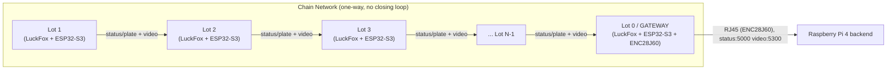

# LuckFox-PicoMini-ParkingVision

A distributed smart parking monitoring vision system utilizing **LuckFox Pico Mini** AI camera boards paired with **ESP32-S3 RAP** nodes, chained together and bridged to a Raspberry Pi 4 backend over wired Ethernet.

Every node in this project is a **parking lot** -- there is no separate entrance/gate node yet (may be added later as its own thing).

---

## System Components (per node)

Each parking-lot node is one **LuckFox Pico Mini** + one **ESP32-S3**, wired together over SPI:

1. **LuckFox Pico Mini (RV1103) -- on-device vision AI**
   - Reads a camera feed, encodes/splits it into **3x 600x400 video streams**.
   - Pipeline per stream: motion detection -> AI car detection -> sleep briefly -> occupancy check (vacant/occupied) -> if occupied, crop + OCR the plate.
   - Sends the 3 encoded video streams and, if present, the cropped plate result to its paired ESP32-S3.

2. **ESP32-S3 RAP (chain relay + one Gateway uplink)**
   - Runs the exact same firmware on every unit (see [`src/ESP32-S3-RAP`](src/ESP32-S3-RAP)); role and chain position come from a small per-unit provisioning step, not a separate build.
   - One designated node (`node_id == 0`, the **Gateway**) also carries an **ENC28J60** module and bridges to the Raspberry Pi 4 backend over a direct Ethernet cable (RJ45) -- it's still a parking-lot node like any other, just the one with this extra uplink role.

---

## Network Architecture: Chain (not a closed ring)

Despite the "RAP" (Ring Access Protocol) name -- kept from this project's original design for naming continuity (`ring_size`, `node_id`, etc. still appear throughout) -- the topology is a **one-way chain**, not a closed loop: there's no "first" node and the Gateway has no outgoing link back into the chain, it only sinks data out to the RPi4.

Every node has its own initiative: it originates its own occupancy/plate reading and video frames on its own schedule, and relays whatever it receives from its upstream neighbor (`prev`) toward its downstream neighbor (`next`) -- both interleaved through the same per-hop link. Two independent transports run in parallel over the same radio:

- **ESP-NOW** -- small `StatusPacket`s (`origin_node_id`, `seq`, `occupied`, `plate`), hop-by-hop with stop-and-wait flow control (a node only accepts a new packet from `prev` once it has room to forward it to `next`).
- **WiFi AP+STA daisy-chain (TCP)** -- bulk video, since raw frames are far too large for ESP-NOW's 250-byte limit. Each frame carries `{origin_node_id, stream_id, seq, data_len}` so its source lot and camera are always identifiable, even after several relay hops.



### Why a chain instead of a mesh/star

- **Deterministic, low-collision flow**: every hop is a simple point-to-point link (ESP-NOW unicast + a WiFi AP/STA pair), so there's no contention/arbitration between nodes for a shared medium.
- **Backpressure, not packet loss**: per-hop stop-and-wait means a slow/busy hop naturally throttles the whole chain instead of dropping data silently.
- **Simple cabling-free daisy-chaining**: adding a lot just means provisioning one more node with the next `node_id`; no rewiring of a shared bus or router needed.

Self-healing/re-routing around a permanently dead node is **not** implemented yet -- see `docs/network/topology.md` in the submodule for the full list of current limitations.

---

## Data reaching the backend

Both channels tag every reading/frame with `origin_node_id`, so the Raspberry Pi 4 backend can always tell which lot (and, for video, which of its 3 cameras) a piece of data came from:

| Channel | Port | Content |
| :--- | :--- | :--- |
| Status/plate | 5000 | One line per reading: `node_id:occupied:plate` |
| Video | 5300 | Binary, one frame per message: `{origin_node_id, stream_id, seq, data_len}` + raw frame bytes |

Naming a lot (e.g. "Lot A0") is a Raspberry Pi-side concern, not firmware: see [`backend/node_names.json`](backend/node_names.json) and the demo listener scripts in the same folder (`status_listener.py`, `video_listener.py`), which resolve `node_id -> name` and prove data is separable/displayable per lot. This `backend/` folder is plain Python living directly in this repo (not the ESP32 firmware submodule, and not a submodule itself) -- it's Raspberry Pi-side code, kept separate from the ESP32-S3 firmware.

---

## Getting Started

### Cloning the Repository
```bash
git clone --recurse-submodules https://github.com/AndhikaFW/LuckFox-PicoMini-ParkingVision.git
```

If already cloned without submodules:
```bash
git submodule update --init --recursive
```

### Layout

- [`src/ESP32-S3-RAP`](src/ESP32-S3-RAP) -- ESP32-S3 firmware **only** (its own git submodule/repo). Build/flash/provisioning instructions and the full protocol/topology write-up live there: [`docs/network/topology.md`](src/ESP32-S3-RAP/docs/network/topology.md).
- [`backend/`](backend) -- Raspberry Pi 4-side Python (demo listeners + `node_names.json`). Plain files in this repo, not inside the firmware submodule and not a submodule of its own -- there's nothing here that needs its own version history separate from the rest of this repo.
