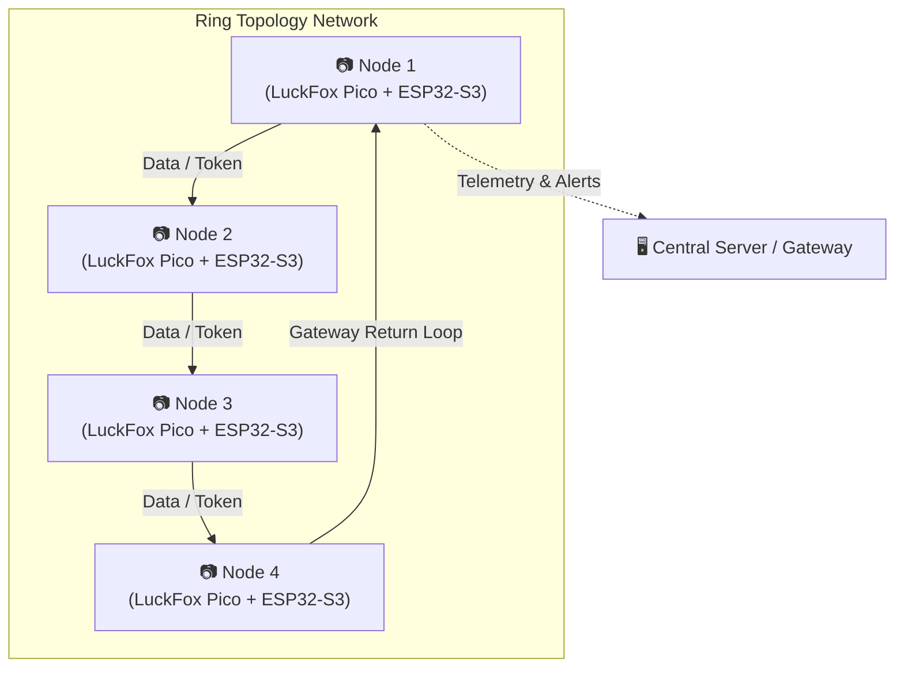

# LuckFox-PicoMini-ParkingVision

A distributed smart parking monitoring vision system utilizing **LuckFox Pico Mini** AI camera boards paired with **ESP32-S3 RAP** nodes configured in a **Ring Topology** network architecture.

---

## 🌐 Network Architecture: Ring Topology

The system uses a **Ring Topology** network structure to connect multiple parking lot monitoring nodes sequentially. Each node (consisting of a LuckFox Pico Mini for AI vision processing and an ESP32-S3 for wireless/serial relay) receives data from its preceding neighbor and forwards telemetry, occupancy alerts, and processing results to the next node in the ring.



### Key Advantages of Ring Topology in Parking Vision
- **Deterministic Data Flow**: Telemetry and parking spot occupancy status are passed sequentially with minimal network collision risk.
- **Redundancy & High Availability**: If dual-ring (counter-rotating) paths are enabled, any single link failure automatically redirects packet flow in the reverse direction.
- **Scalable Daisy-Chaining**: Simplified cabling and power/data distribution across long parking lot rows.

---

## ⚙️ System Components

1. **LuckFox Pico Mini (Main Vision Processor)**
   - **Task**: Runs edge AI parking lot vision models (RKNN object detection / vacancy checking).
   - **Output**: Generates real-time parking slot occupancy status (Vacant / Occupied).

2. **ESP32-S3 RAP (Relay & Access Point)**
   - **Task**: Handles inter-node ring communication, token passing, and heartbeat signaling.
   - **Repository Submodule**: Located in [`src/ESP32-S3-RAP`](file:///C:/Users/User/Documents/LuckFox-PicoMini-ParkingVision/src/ESP32-S3-RAP)

---

## 🔄 Data Packet Structure in the Ring

Each packet traversing the ring contains:
| Field | Type | Description |
| :--- | :--- | :--- |
| `node_id` | `uint8_t` | Unique identifier for the origin node |
| `timestamp` | `uint32_t` | Epoch timestamp |
| `slot_status` | `uint16_t` | Bitmask of monitored parking spaces |
| `token_flag` | `bool` | Ring access token marker |
| `crc16` | `uint16_t` | Data integrity check |

---

## 🚀 Getting Started

### Cloning the Repository
```bash
git clone --recurse-submodules https://github.com/AndhikaFW/LuckFox-PicoMini-ParkingVision.git
```

If already cloned without submodules:
```bash
git submodule update --init --recursive
```
